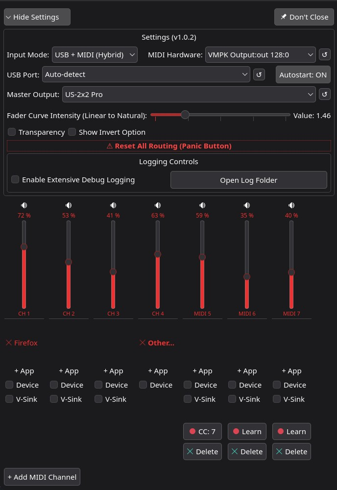

# NativMix

NativMix is a modern, hardware-based volume mixer for Linux, built with PyQt6. Designed as a powerful alternative to deej, it connects physical Arduino potentiometers via USB directly to the PipeWire/PulseAudio audio stack.


## Screenshots

<p align="center">
  <strong>Breeze Theme (Native)</strong> &nbsp;&nbsp;&nbsp;&nbsp;&nbsp;&nbsp;&nbsp;&nbsp;&nbsp;&nbsp;&nbsp;&nbsp;&nbsp;&nbsp;&nbsp;&nbsp; <strong>Iridescent Theme</strong><br>
  
  
</p>

<p align="center">
  <strong>Nothing Theme</strong><br>
  
</p>

## Features

### 🎚️ Hardware Integration
- **[deej](https://github.com/omriharel/deej) Compatibility**: Fully compatible with the standard deej Arduino protocol.
- **Improved Firmware**: For an enhanced experience and up-to-date Arduino code, we recommend using **[deejHotkey](https://github.com/knoellix/deejHotkey)**. This repository provides optimized sketches and modern alternatives to the original deej firmware, specifically tailored for advanced setups.
- **Physical Slider Control**: Map each Arduino potentiometer to one or more audio applications.
- **Volume Curve Intensity**: Adjustable fader curve shape (Linear to Cubic) for natural volume perception.
- **Per-Channel Inversion**: Flip the direction of any potentiometer (0 = 100%, 1023 = 0%), configurable per channel or globally.
- **Auto-Detect & Hot-Plug**: Automatically detects `/dev/ttyACM0`, `/dev/ttyUSB0`, or any USB-serial device. Reconnects automatically if the Arduino is unplugged.
- **Auto-Unmute on Move**: A channel that was muted will unmute automatically when the physical slider is significantly moved.
- **🎹 MIDI Control**: 
  - **MIDI-Learn**: Dynamically assign MIDI CC knobs/faders to any channel.
  - **Virtual MIDI Port**: Provides a built-in virtual MIDI device ("NativMix") for headless routing (e.g., via `pw-link`) without needing physical cables or loopbacks.
  - **Direct Integration**: Native support for ALSA and USB-MIDI controllers via `mido`.
  - **High Precision**: Low-latency volume control with 7-bit MIDI resolution.

### 🔊 Audio Routing
- **App Mode**: Directly control the volume of individual application audio streams.
- **Multi-App Grouping**: Assign multiple applications to a single slider.
- **System Master**: One channel can control the system master volume and mute state of the default output device.
- **Other Apps**: Assign a channel to control all unmapped audio streams as a group.
- **Hardware Mode**: Directly control the volume of physical audio devices (speakers, headphones, or microphones).

### 🔁 Pro-Routing: Virtual Sinks (V-Sinks)

NativMix utilizes dedicated software output devices (Virtual Sinks) in PipeWire to solve a common Linux audio issue: **Audio Spikes.**

#### The Problem: Volume Spikes
Many applications (like web browsers or media players) momentarily reset their internal stream volume to 100% when seeking, fast-forwarding via keyboard, or recovering from a "hanging" stream. This often causes painful, full-volume "spikes" before PipeWire or a standard mixer can re-apply the correct fader level.

#### The Solution: Isolation via V-Sinks
By creating a Virtual Sink as an intermediary, NativMix decouples the application from the physical output:
- **Signal Flow**: `App (fixed at 100% Unity Gain) → V-Sink (Controlled by Hardware Fader) → Physical Output`.
- **Persistence**: Since the App always plays at 100% inside its own isolated "tunnel," any seek-related reset has **zero impact** on the actual output volume. 
- **Hardware Precision**: The physical slider controls the volume of the *Virtual Sink* itself, providing a rock-solid volume ceiling that the application cannot bypass.

#### Features & Constraints:
* **Safe On/Off**: Disabling a V-Sink automatically sets the app to the current fader volume first, then lets PipeWire's native module rescue the stream without pausing or interrupting playback.
* **Isolation Rules**: To ensure system stability and prevent feedback loops, the *System Master* and *Other Apps* channels cannot be routed through V-Sinks.

### 🛡️ Mute-Catch Reflex System (Rule 11)
Prevents 100% volume "audio blasts" when new audio streams start:
- **Stage 1 (Reflex)**: Immediately mutes any new audio stream before metadata is available.
- **Stage 2 (Resolution)**: Once the app name is resolved, applies the saved slider volume and unmutes.

### 🧠 Intelligent App Resolution
- Identifies sandboxed Electron/Chromium apps (Discord, Spotify, Chrome) by parsing `/proc/<PID>/cmdline` and traversing the process tree.
- Handles generic stream names like "Chromium" or "WEBRTC Voice Engine" correctly.

### 🎨 Native System Theming
- Reads dark/light mode and accent color via the **XDG Desktop Portal** (`org.freedesktop.portal.Settings`) – works on KDE, GNOME, and all XDG-compliant desktops.
- Style priority: **Kvantum** → **Breeze** → **Fusion** (with a dark fallback palette).
- Fader colors use the system highlight/accent color via `QPalette`.
- **Transparency**: Optional translucent window background.

### 🖥️ Native Wayland Integration
- Process title set via `setproctitle` (correct name in `htop`, system monitors).
- Window/icon linked to `.desktop` file via `app.setDesktopFileName()`.
- No X11 window scraping (`wmctrl`, `xdotool`).

### 🔌 IPC & CLI Control (Global Hotkeys)

NativMix features a built-in IPC (Inter-Process Communication) server. This allows you to control the running instance of NativMix via the command line without launching a second GUI or interrupting the hardware communication.

#### Available Commands:
| Command | Description |
| :--- | :--- |
| `--toggle-mute <INDEX>` | Toggles mute for channel X (0-indexed). |
| `--list-sinks` | Returns a list of all active Virtual Sinks and their indices. |
| `--list-apps` | Returns a list of all detected audio applications. |
| (no args) | Brings the already running window to the foreground. |

**Example (Mute Discord on Channel 1):**
```bash
sh -c "/usr/bin/nativmix --toggle-mute 1"
```

### ⚙️ Settings
- **Serial Port Selection**: Choose port or leave on auto-detect. Connected port is marked with ★.
- **Master Output Selector**: Choose the default playback device directly from NativMix.
- **Fader Curve Intensity**: Slider to adjust the volume curve (Linear » Quadratic » Cubic).
- **Don't hide**: When active, closing the window (X) will only hide it to the system tray. The background service remains active.
- **Autostart**: Toggle autostart on boot by copying/removing the `.desktop` file from `~/.config/autostart/`.
- **Transparency**: Toggle window translucency.
- **Panic Button**: One-click reset – evacuates all apps from V-Sinks, destroys sinks, resets routing.
- **Debug Logging**: Enable verbose `DEBUG`-level logging dynamically (affects logs inmediatamente).
- **Open Log Folder**: Opens the log directory in the system file manager.

### 🗂️ Tray Icon
- Left-click or double-click to show/hide the main window.
- Right-click for Quick-Quit.

---

### 🖥️ Supported Operating Systems

| OS | Status | Installation Method |
| :--- | :--- | :--- |
| **Arch Linux / CachyOS** | **Stable** | `paru -S nativmix` (AUR) |
| **openSUSE Tumbleweed** | **Stable** | `zypper install nativmix` (via OBS) |
| **Fedora / Ubuntu / Debian** | *Testing* | Manual build from source |
| **SteamOS / Winndoof** | *Planned* | Development in progress |

---

### 📦 Installation Guide

#### **Arch Linux / CachyOS (AUR)**
NativMix is available in the Arch User Repository (AUR). You can install it using your favorite AUR helper:
```bash
paru -S nativmix
```

#### **openSUSE Tumbleweed (OBS)**
Add the repository to receive automatic updates (e.g., v1.0.3):
```bash
sudo zypper addrepo https://download.opensuse.org/repositories/home:/knoelliX/openSUSE_Tumbleweed/ nativmix
sudo zypper refresh
sudo zypper install nativmix
```

#### **Manual Installation (from Source)**
1. **Clone:** `git clone https://github.com/knoellix/NativMix.git && cd nativmix`
2. **Run:** `PYTHONPATH=lib python3 lib/nativmix/main.py`
3. **Build Package (Arch):** `cd packaging/aur && makepkg -si`

### 🛠️ Dependencies
`python-pyqt6`, `python-pulsectl`, `python-pyserial`, `python-setproctitle`, `python-mido`, `python-rtmidi`

---

### 🔑 Permissions & Hardware Access

#### **Automatic (Recommended)**
For **Arch Linux** and **openSUSE**, the packages include a custom udev rule (`99-nativmix-arduino.rules`).
- **Effect**: Grants the logged-in user permission via the `uaccess` tag.
- **Reload**: `sudo udevadm control --reload-rules && sudo udevadm trigger`

#### **Manual Fallback**
If the automatic setup fails, add your user and restart your session:
- **openSUSE**: `sudo usermod -aG dialout,audio $USER`
- **Arch Linux**: `sudo usermod -aG uucp,audio $USER`

> [!IMPORTANT]
> You must log out and log back in for group changes to take effect.

---

## Hardware Setup (Arduino)

NativMix is compatible with standard **deej** firmware. The Arduino sends pipe-separated ADC values (0–1023) as a newline-terminated string:
`512|0|1023|256\n`

---

## Configuration

Settings are stored at `~/.config/nativmix/config.json` (XDG standard).
Data and logs are written to `~/.local/share/nativmix/` and `~/.cache/nativmix/logs/`.

---

## License
GPL-3.0 – see [LICENSE](LICENSE) for details.
