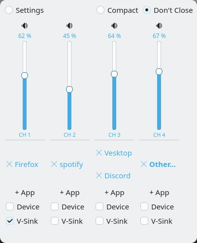
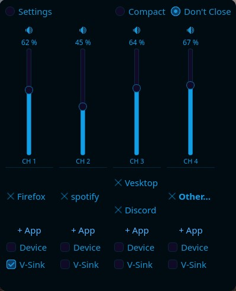

# NativMix (Deutsch)

NativMix ist ein hardwaregestützter Lautstärkemixer für Linux, entwickelt mit PyQt6. Er verbindet physische Arduino-Potentiometer über USB mit PipeWire/PulseAudio und ermöglicht die Lautstärkeregelung einzelner Apps über echte Regler. Jeder Kanal lässt sich einer oder mehreren Apps, einem Gerät oder dem System-Master zuweisen. **Virtual Sinks** isolieren Apps in einem eigenen PipeWire Null-Sink — seek-bedingte Lautstärke-Spikes erreichen deine Lautsprecher nie mehr, weil der Regler den Sink steuert und die App intern auf Unity Gain läuft. Neue Streams werden sofort stumm geschaltet (Two-Stage Mute-Catch), bevor Metadaten verfügbar sind, und dann auf dem richtigen Fader-Pegel freigegeben. MIDI-CC-Controller werden nativ neben dem Arduino unterstützt, mit MIDI-Learn und einem integrierten virtuellen MIDI-Port. Die GUI passt sich automatisch ans System-Theme an (via XDG Desktop Portal) und funktioniert auf KDE, GNOME und allen XDG-konformen Desktops einschließlich Wayland.


<div align="center">

| Breeze Theme (Native) | Iridescent Theme |
|:---:|:---:|
|  |  |

</div>

---

## Status

> Daten zur MIDI-Stabilität werden noch gesammelt — Feedback von MIDI-Nutzern ist sehr willkommen.
>
> **Hinweis zu "Stabil":** Sofern nicht anders angegeben bedeutet "Stabil", dass das Paket installiert und beim ersten Start keine offensichtlichen Fehler auftreten. Nur **Arch Linux / CachyOS** wird täglich genutzt und produktiv getestet.

| Betriebssystem | Status | Hinweis |
| :--- | :---: | :--- |
| **Arch Linux / CachyOS** | ✅ Stabil | AUR-Paket, täglich genutzt |
| **Ubuntu 25.04 / 25.10** | ✅ Stabil | OBS-Paket, getestet auf Pop!_OS |
| **Pop!_OS** | ✅ Stabil | COSMIC Desktop, GUI getestet, keine Log-Fehler |
| **openSUSE Tumbleweed** | ✅ Stabil | OBS-Paket, GUI getestet, keine Log-Fehler |
| **openSUSE Slowroll** | ❓ Ungetestet | OBS-Paket |
| **Fedora 42 / 43** | 🔧 In Arbeit | OBS-Paket, wird aktuell bearbeitet |
| **Debian 12 / 13** | 🔧 In Arbeit | OBS-Paket, nicht getestet |
| **COSMIC Desktop** | ✅ Stabil | Getestet auf Pop!_OS |
| **Raspberry Pi OS** | ❓ Ungetestet | Kann nicht verifiziert werden — Hardware nicht verfügbar |
| **Windows** | 📋 Geplant | — |

[](https://build.opensuse.org/package/show/home:knoelliX/nativmix)

---

## Installation

→ **[Vollständige Installationsanleitung](https://github.com/knoellix/NativMix/wiki/Installation)**

**Arch Linux / CachyOS:**
```bash
paru -S nativmix
```

**openSUSE Tumbleweed:**
```bash
sudo zypper addrepo https://download.opensuse.org/repositories/home:/knoelliX/openSUSE_Tumbleweed/ nativmix
sudo zypper refresh && sudo zypper install nativmix
```

---

## Dokumentation

- [Wiki (EN)](https://github.com/knoellix/NativMix/wiki/)
- [Wiki (DE)](https://github.com/knoellix/NativMix/wiki#nativmix-wiki-deutsch)

---

## Lizenz
GPL-3.0 – siehe [LICENSE](LICENSE) für Details.
